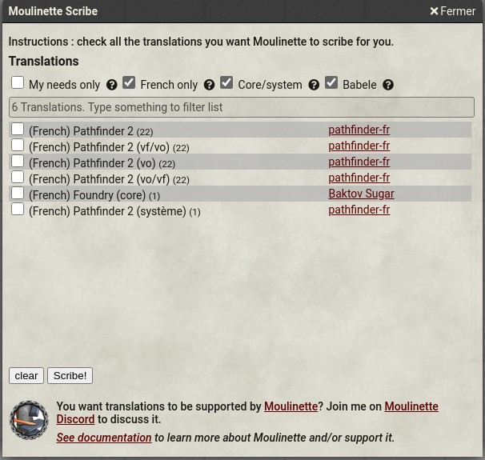

# Moulinette Scribe (Foundry VTT)

This is a submodule for [Moulinette Core](https://github.com/SvenWerlen/moulinette-core). See [Moulinette Core](https://github.com/SvenWerlen/moulinette-core) for an overview of all modules.

## Manage translations

Scribe is intended for non-english communities. Moulinette Scribe lets you browse a catalog of available translations maintained by the communities
* Search in the catalog (use smart filters!)
* Check the translations you want to install
* Scribe!

### Benefits
* Quick and easy search for available translations
* Doesn't require the installation of additional modules
* Supports Core & Babele translations
* Can be updated without exiting your worlds nor restarting the server
* Translators can provide translations for any module/system without having to create a module or ask the developer to include the translations
* Translations can be hosted anywhere (GitHub, GitLab, public website, etc.)

## <a name="install"/>Install the module

To **install** the module from FoundryVTT:
1. Start FVTT and browse to the Game Modules tab in the Configuration and Setup menu
2. Search for "Moulinette Forge" and click install on the desired module

To **manually install** the module (not recommended), follow these instructions:

1. Start FVTT and browse to the Game Modules tab in the Configuration and Setup menu
2. Select the Install Module button and enter the following URL: https://raw.githubusercontent.com/svenwerlen/moulinette-scribe/master/module.json
3. Click Install and wait for installation to complete 

## <a name="support"/>Support me on Patreon

If you like my work and want to support me, consider becoming a patreon!

[https://www.patreon.com/moulinette](https://www.patreon.com/moulinette)

You can also join [Moulinette Discord](https://discord.gg/xg3dcMQfP2)
